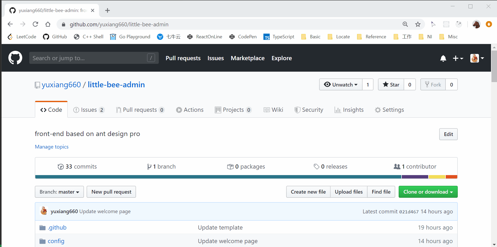
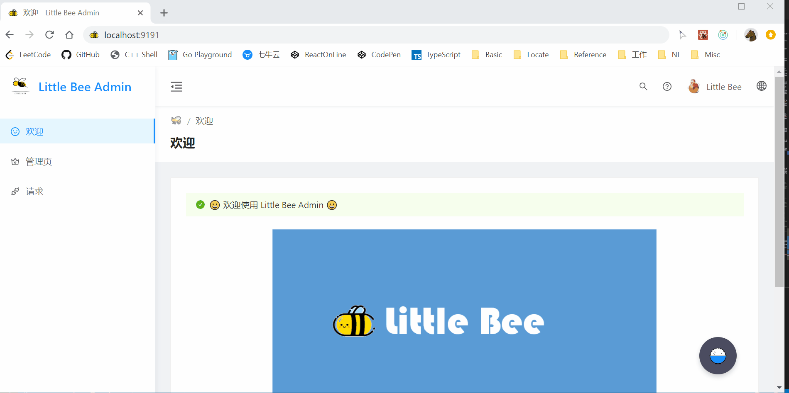
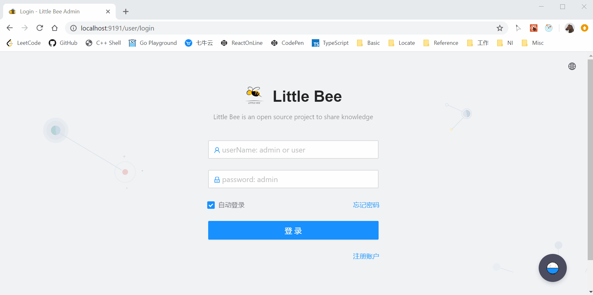
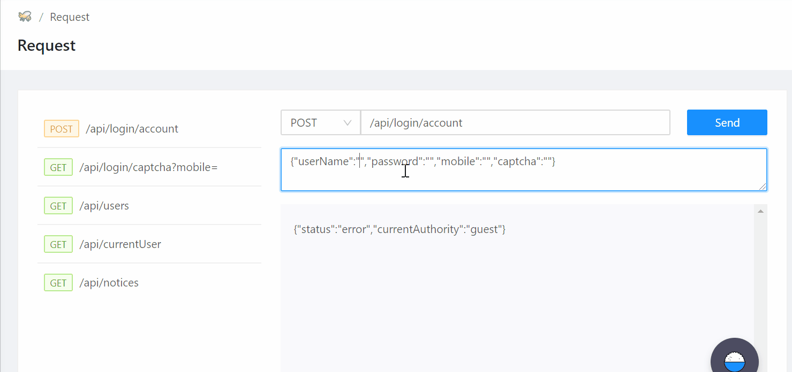

# Why

为了让大家了解“蜂监工”项目，这篇博文详细介绍了“蜂监工”项目的工作原理。

## “蜂监工”的目的什么？

“蜂监工”是[“蜂乐园”平台](/pages/2/about/)后台客户端，用于监管“蜂乐园”平台，包括，查看“蜂乐园”服务器状态，管理“蜂乐园”用户、数据等。

## “蜂监工”为什么选择"Ant Design Pro"框架？

“蜂监工”的目的是为了管理“蜂乐园”平台，那么对它至少有两个要求：
- 拥有用户友好的界面，便于用户进行管理
- 支持`REST API`操作，可以和服务器通信

### "react-admin"和"Ant Design Pro"对比

在`React`社区中，["react-admin"](https://github.com/marmelab/react-admin)和["Ant Design Pro"](https://pro.ant.design/docs/getting-started-cn)是比较成熟的后台管理框架。它们都不仅集成了成熟的UI框架，还封装了`react-router`，`react-redux`等通用模块。

#### UI风格

"react-admin"用的是["Material-UI"](https://material-ui.com/zh/)UI框架，而"Ant Design Pro"用的是["Ant Design"](https://ant.design/index-cn)UI框架。对UI风格在这里不予置评，下面列出了两种UI框架的`Button`组件，大家可根据个人喜好进行选择：
- ["Material-UI Button组件"](https://material-ui.com/zh/components/buttons/)
- ["Ant Design Button组件"](https://ant.design/components/button-cn/)

#### 与服务器交互方式

- "react-admin"的["Data Provider"](https://marmelab.com/react-admin/DataProviders.html)
"react-admin"通过`Data Provider`与服务器交互，官方提供通用的`Data Provider`，但如果您的需求比较复杂，就需要自行编写`Data Provider`。


- "Ant Design Pro"的["UmiJS-request"](https://github.com/umijs/umi-request)
"Ant Design Pro"采用了[`UmiJS`](https://umijs.org/zh/guide/)的"UmiJS-request"库，作为与服务器交互手段。是一种比较通用的做法，而且并没有强制用户必须使用"UmiJS-request"。用户也可以用自己喜欢的其他库，如`react-axios`等。

#### 个人喜好

个人感觉，"react-admin"封装地相对彻底，`Data Provider`屏蔽了大部分细节，如果通用的`Data Provider`可以满足用户需求，上手会非常快。而"Ant Design Pro"并不直接封装`react-router`或`react-redux`等模块，而是直接利用其他框架，如：["UmiJS"](https://umijs.org/zh/guide/)和["DvaJS"](https://dvajs.com/guide/)等。因此，用户在使用"Ant Design Pro"时，还需对其他框架有所了解。如果您对"Ant Design Pro"有进一步的兴趣，可以参考"蜂博客"[什么是"Ant Design Pro"]()。

> 封装和灵活度是硬币的两面。

如果封装过度，势必影响使用的灵活性。如果封装过于简单，也会暴露过多细节给用户，给二次开发造成沉重的负担。一个好的框架，应该是开放而友好的。轻度用户可以快速上手，重度用户也有办法深度开发。在这点上，个人觉得"Ant Design Pro"较"react-admin"更出色。尤其是"Ant Design Pro"可以利用["DvaJS"](https://dvajs.com/guide/)，十分方便地进行`redux`模式开发。如果大家对`redux`模式感兴趣，可以参考“蜂博客”：[什么是"redux"模式]()。

# What

## “蜂监工”是什么项目？

“蜂监工”是“蜂乐园”项目中的基于`Ant Design Pro`框架，支持`REST`风格的后台客户端，是“蜂乐园”的协调者，用于管理“蜂乐园”用户、数据等。之所以叫“蜂监工”，是因为它负责监管整各“蜂乐园”平台。当前“蜂监工”已经完成了框架的搭建，如：可以和服务器进行`REST`风格的通讯，实现用户`Token`登录等。但是，具体功能还在开发中，希望以后其可以有更多强大的功能供用户使用。

## “蜂监工”是如何工作的？

- [项目展示](https://github.com/yuxiang660/little-bee-admin)


## “蜂监工”是如何实现的？

“蜂监工”是一个基于["Ant Design Pro"](https://pro.ant.design/)框架的后台客户端。下面罗列了部分“蜂监工”涉及的技术。如果您对以项某项内容感兴趣，那么您可以继续往下看。在“How”部分，我们将详细介绍“蜂监工”是如何实现的。
- [`Ant Design Pro`](https://pro.ant.design/)
- [`Ant Design`](https://ant.design/)
- [`UmiJS`](https://umijs.org/)
- [`DvaJS`](https://dvajs.com/)
- [`Redux`](https://react-redux.js.org/)

# How

## “蜂监工”项目结构

* [“蜂监工”](https://github.com/yuxiang660/little-bee-admin)在`GitHub`上的文件组织结构如下：
    “蜂监工”是基于[官方模板](https://pro.ant.design/docs/getting-started-cn#%E5%AE%89%E8%A3%85)创建的，因此基础目录结构可参考[官方说明](https://pro.ant.design/docs/getting-started-cn#%E7%9B%AE%E5%BD%95%E7%BB%93%E6%9E%84)。

```js
.
├── README.md
├── build
|   └── dist                   // 存放Typescript编译输出
├── config                     // 存放用户配置
|   ├── config.ts              // 主配置文件，可定义菜单，路由，布局等
|   ├── defaultSettings.ts     // 默认配置，包括菜单样式，主题颜色等
|   ├── plugin.config.ts       // 项目插件配置
|   └── themePluginConfig.ts   // 可选主题
├── dist                       // 存放项目build输出
├── jest-puppeteer.config.js   // jest配置
├── jest.config.js             // jest配置
├── jsconfig.json              // 对Javascript文件的主配置
├── mock                       // 测试的mock文件
├── package.json               // 项目包管理文件
├── public                     // 静态资源存放目录，如icon，build后会被一起复制到/dist目录
├── src                        // 源文件
|   ├── assets                 // 静态资源存放目录，如logo，build后会被一起复制到/dist/static目录
|   ├── components             // React组件
|   ├── e2e                    // 集成测试用例
|   ├── global.less            // 框架文件，全局样式
|   ├── global.tsx             // 框架文件，和PWA相关
|   ├── layouts                // 通用布局
|   ├── locales                // 国际化资源
|   ├── manifest.json          // 框架文件，和PWA相关
|   ├── models                 // 全局 dva model
|   ├── pages                  // 页面入口，可在/config/config.ts中和路由绑定
|   ├── service-worker.js      // 框架文件
|   ├── services               // 后台接口服务
|   ├── typings.d.ts           // 对某些全局模块进行声明，服务于Typescript
|   └── utils                  // 工具库
├── tests                      // 测试配置脚本
└── tsconfig.json              // 对Typescript文件的主配置
```

## “蜂监工”如何创建一个无交互页面

“蜂监工”渲染一个新页面只需要两个步骤：
- 在["/config/config.ts"](https://github.com/yuxiang660/little-bee-admin/blob/master/config/config.ts)中添加路由
- 在["/src/pages"](https://github.com/yuxiang660/little-bee-admin/tree/master/src/pages)目录中添加新页面组件

下面以["welcome"](https://github.com/yuxiang660/little-bee-admin/tree/master/src/pages/welcome)页面为例子，阐述“如何创建一个无交互页面”。

### "welcome"页面效果
- 启动“蜂监工”，输入"welcome"页面的URL：["http://localhost:9191/welcome"](http://localhost:9191/welcome)，得到如下页面：


### 为"welcome"页面添加路由
在["/config/config.ts"](https://github.com/yuxiang660/little-bee-admin/blob/master/config/config.ts)的`routes[]`中添加如下代码：

```js
{
    path: '/welcome',
    name: 'welcome',
    icon: 'smile',
    component: './welcome',
},
```

- `path`指定了URL地址
- `name`指定了此页面在菜单栏中的显示文字
- `icon`指定了此页面在菜单栏中的显示图标
- `component`指定了此页面组件在`/src/pages`文件夹中的相对位置

具体步骤可参考[官网教程](https://pro.ant.design/docs/router-and-nav-cn)。

### 为"welcome"页面添加组件

在["/src/pages"](https://github.com/yuxiang660/little-bee-admin/tree/master/src/pages)目录中添加新文件夹["welcome"](https://github.com/yuxiang660/little-bee-admin/tree/master/src/pages/welcome)，并在其中新建入口文件["index.txs"](https://github.com/yuxiang660/little-bee-admin/blob/master/src/pages/welcome/index.tsx)，代码如下：

```js
// ./welcome/index.txs
export default (): React.ReactNode => (
  <PageHeaderWrapper>
    <Card>
      ...
      <Carousel autoplay>
        <div className={styles.container}>
          
        </div>
        ...
      </Carousel>
    </Card>
  </PageHeaderWrapper>
);
```

"index.txs"文件`export`了一个[`React-JSX`](https://reactjs.org/docs/introducing-jsx.html)组件。此组件会被框架的[`Layout`](https://github.com/yuxiang660/little-bee-admin/tree/master/src/layouts)组件接收并渲染。每个页面的`Layout`也是定义在["/config/config.ts"](https://github.com/yuxiang660/little-bee-admin/blob/master/config/config.ts)中。"welcome"的`Layout`组件为`BasicLayout`，定义如下：

```js
routes: [
{
    path: '/',
    component: '../layouts/BasicLayout', // 此块区域的Layout都为BasicLayout
    authority: ['admin', 'user'],
    routes: [
    {
        path: '/welcome',
        name: 'welcome',
        icon: 'smile',
        component: './welcome',
    },
]
```

对`Layout`的详细配置，可参考[官网教程](https://pro.ant.design/docs/layout-cn)。

## “蜂监工”如何创建一个服务器交互页面

在"Ant Design Pro"中，一个完整的UI交互到服务器处理流程如下（[官网教程](https://pro.ant.design/docs/server-cn)）：
- UI 组件交互操作；
- 调用 model 的 effect；
- 调用统一管理的 service 请求函数；
- 使用封装的 request.ts 发送请求；
- 获取服务端返回；
- 然后调用 reducer 改变 state；
- 更新 model。

下面以["request"](https://github.com/yuxiang660/little-bee-admin/tree/master/src/pages/request)页面为例子，阐述“如何创建一个服务器交互页面”。

### "request"页面效果
- 启动“蜂监工”，输入登录页面URL：["http://localhost:9191/login"](http://localhost:9191/login)登录“蜂监工”，用户名密码均为“admin”。在菜单栏定位到"request"页面，按下图操作从服务器得到所有用户信息：


### 为"request"页面添加路由

"request"页面路由的创建方法和"无交互页面"是一样的，可参考上面部分：[为"welcome"页面添加组件](/posts/5/2020-02-10---Little-Bee-Admin-Intro/#为welcome页面添加路由)。

### 为"request"页面添加"UI"组件

["request"](https://github.com/yuxiang660/little-bee-admin/tree/master/src/pages/request)组件目录结构如下：

```js
└──request               // Request组件主目录
    ├── apiList          // Request组件的子组件目录，对应request页面左侧的"URL"列表
    │   ├── index.less   // ApiList子组件样式
    │   └── index.tsx    // ApiList子组件
    ├── command          // Request组件的子组件目录，对应request页面右侧的命令发送和接收列表
    │   ├── index.less   // Command子组件样式
    │   └── index.tsx    // Command子组件
    ├── index.less       // Request组件样式
    └── index.tsx        // Request组件
```

不同于"welcome"页面的"UI"组件，"request"页面的"UI"组件是可以和用户交互的。如下图所示，用户点击"URL"列表，右侧的输入框中的内容会变化。


#### 什么是"redux"

“蜂监工”采用"redux"模式实现不同组件的状态共享，以达到上面的效果。"Ant Design Pro"利用"UmiJS"和"DvaJS"可快速实现"redux"模式，可参考"UmiJS"的官方教程：[Use umi with dva](https://umijs.org/zh/guide/with-dva.html)。"redux"模式相对复杂，其中涉及很多概念，简单来说，就是两点：1. 状态变化单向流动；2. 全局共享状态。详情可参考“蜂博客”：[什么是"redux"]()。

"Ant Design Pro"调试"redux"模式非常方便，通过["Redux DevTools"](https://chrome.google.com/webstore/detail/redux-devtools/lmhkpmbekcpmknklioeibfkpmmfibljd?hl=en)工具，可以查看所有共享状态的变化。


#### 如何实现"redux"

- 为"request"组件创建[`model`](https://github.com/yuxiang660/little-bee-admin/blob/master/src/models/request.ts)， 所有"request"组件可共享此`model`中的状态。

```js
/* ./src/models/request.ts */
// 共享状态的类型
export interface RequestStateType {
    method?: 'POST' | 'GET' | 'PUT' | 'PATCH' | 'DELETE';
    url?: string;
    ...
}

reducers: {
    // 修改共享状态的方法
    changeApiRoute(state, { payload }) {
      return {
        ...state,
        method: payload.method ? payload.method : state?.method,
        url: payload.url ? payload.url : state?.url,
      };
    },
}
```

- 绑定点击动作到[`ApiList`组件](https://github.com/yuxiang660/little-bee-admin/blob/master/src/pages/request/apiList/index.tsx)，修改共享状态。

```js
<List.Item
    onClick={() => {
        const { dispatch } = props;
        // dispatch 方法会调用request model中的changeApiRoute，按照payload修改共享状态
        dispatch({
            type: 'request/changeApiRoute',
            payload: { method: item.method, url: item.url },
        });
        ...
    }}
>
```

- ["Command"组件](https://github.com/yuxiang660/little-bee-admin/blob/master/src/pages/request/command/index.tsx)渲染修改的共享状态给用户。

```js
<Input
    value={request.url}
    ...
/>
...
// 连接Command组件和共享状态，以此通过"request"获取共享状态"request.url"
export default connect(({ request }: ConnectState) => ({
    request,
}))(Command);
```

至此，"request"页面的"UI"界面就开发完成了，下面为"request"页面添加服务器交互功能。

### 为"request"页面添加服务器交互

#### "request"页面服务器交互效果

如下图所示，当点击"Send"按钮时，网页会向服务器发起`request`请求，服务器处理完后，返回`respond`给网页，网页将收到的数据显示到`results`框中。



#### 如何用"redux"实现服务器交互

与"UI"交互相同的是，服务器交互也是通过改变全局状态，通知相关组件重新渲染数据。而与"UI"交互不同的是，服务器交互是异步操作，因此需要触发`effect`操作。

- 添加`effect`操作到["request model"](https://github.com/yuxiang660/little-bee-admin/blob/master/src/models/request.ts)。

```js
/* ./src/models/request.ts */
export interface RequestStateType {
    respond?: string; // 用于存储服务器返回数据
    ...
}

reducers: {
    // 根据收到的数据，更新全局状态"respond"
    saveResponse(state, action) {
        return {
            ...state,
            respond: JSON.stringify(action.payload),
        };
    },
},

effects: {
    *send({ payload: { method, url, body } }, { call, put }) {
        // 调用"apiRequest"函数，向服务器发起请求
        const { data } = yield call(apiRequest, method, url, body);
        // 得到服务器返回的数据后，通过"saveResponse"更新共享状态
        yield put({
            type: 'saveResponse',
            payload: data,
        });
    },
},

```

- 绑定发起服务器请求到["Command"组件](https://github.com/yuxiang660/little-bee-admin/blob/master/src/pages/request/command/index.tsx)

```js
<Button
    onClick={() => {
        const { dispatch } = props;
        // dispatch 方法会调用request model中的send，payload包含发送给服务器的数据
        dispatch({
        type: 'request/send',
        payload: { method: request.method, url: request.url, body: request.body },
        });
    }}
    ...
>
```

- ["Command"组件](https://github.com/yuxiang660/little-bee-admin/blob/master/src/pages/request/command/index.tsx)在收到服务器数据后，会将数据渲染到网页中。

```js
<div className={styles.result}>{request.respond}</div>
...
// 连接Command组件和共享状态，以此通过"request"获取共享状态"request.respond"
export default connect(({ request }: ConnectState) => ({
    request,
}))(Command);
```

- 至此，还有最后一个问题：`send`函数中向服务器发送请求的函数`apiRequest`是如何实现的？"Ant Design Pro"通过["umi-request"库](https://github.com/umijs/umi-request)实现与服务器的通信。所有服务器通信函数都定义在["src/services"](https://github.com/yuxiang660/little-bee-admin/tree/master/src/services)下。“蜂监工”统一了大部分的服务器请求，[代码](https://github.com/yuxiang660/little-bee-admin/blob/master/src/services/apiRoutes.ts)如下：

```js
/* src/services/apiRoutes.ts */
export async function apiRequest(method: string, url: string, body?: string): Promise<any> {
  let params: any;
  if (body) {
    try {
      params = JSON.parse(body);
    } catch (err) {
      notification.error({
        message: err.name,
        description: err.message,
      });
    }
  }
  // 调用"umi-request"库，发起请求
  return request(url, {
    method,
    data: params,
  });
}
```